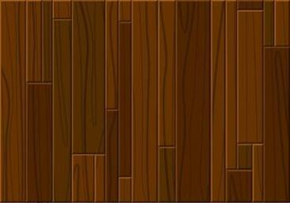
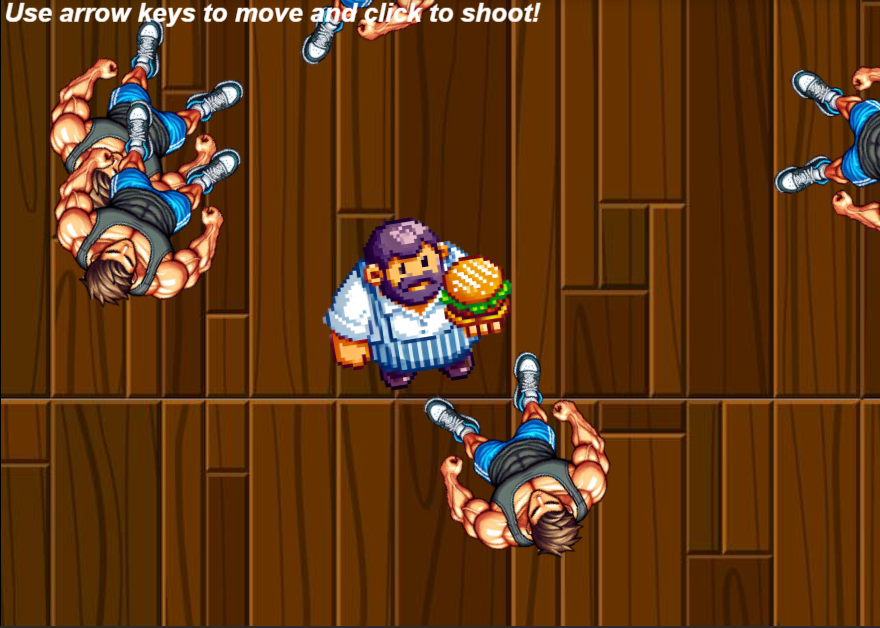
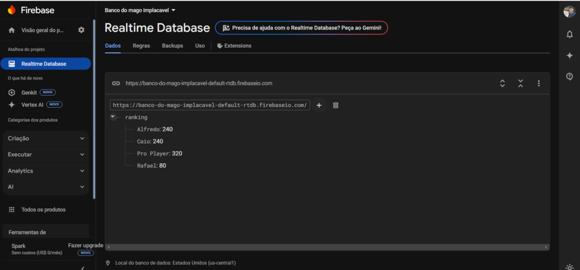

# Gordinho vs Fitness

Jogo desenvolvido no Construct 3

## ✨ Descrição do Projeto

**Gordinho vs Fitness** é um jogo arcade desenvolvido no Construct 3. O jogador controla um personagem gordinho com o objetivo de eliminar personagens fitness (viciados em exercícios) jogando hambúrgueres. Quanto mais inimigos acertar, maior será sua pontuação!

O jogo conta com integração ao Firebase, permitindo salvar o nome dos jogadores e suas pontuações para formar um ranking.

---

## 🔧 Funcionalidades

- 💪 Controle do personagem gordinho
- 🍔 Arremesso de hambúrgueres para eliminar os inimigos
- ✨ Sistema de pontuação salvo no Firebase
- 🏆 Ranking com os melhores jogadores
- 🎨 Design simples e divertido

---

## 💻 Tecnologias Utilizadas

- **Construct 3** - Motor principal do jogo
- **Firebase** - Banco de dados para armazenar pontuações e rankings

---

## 📝 Como Jogar

1. Acesse o jogo online pelo link abaixo.
2. Controle o personagem e arremesse hambúrgueres nos inimigos.
3. Acumule pontos ao acertar os personagens fitness.
4. Veja sua pontuação salva no ranking online!

🔗 **[Jogue Agora](https://www.construct.net/en/free-online-games/gordinho-vs-fitness-74851/play)**

---

## 📚 Repositório no GitHub

Acesse os arquivos do jogo, incluindo o projeto `.cp3` e os sprites, no repositório abaixo:

👉 **[Gordinho vs Fitness - GitHub](https://github.com/caiotaveiraa/fat-game)**

---

## 📸 Sprites da Aplicação

| Personagem Jogável | Inimigo |
|--------------------|---------|
|  |  |

| Poder do personagem | Fundo do jogo | Efeito de explosão |
|--------------------|--------------|----------------|
|  |  |  |

## 📸 Prints da Aplicação

| Jogo em Execução | Ranking do Jogo |
|--------------------|--------------------|
|  |  |

| Firebase |
|--------------------|
|  |

---

## 👨‍🎓 Desenvolvido por

**Caio Taveira - 23947**

